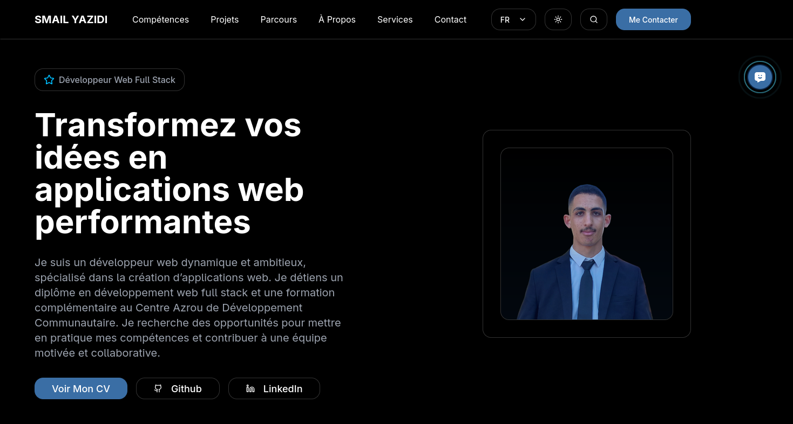
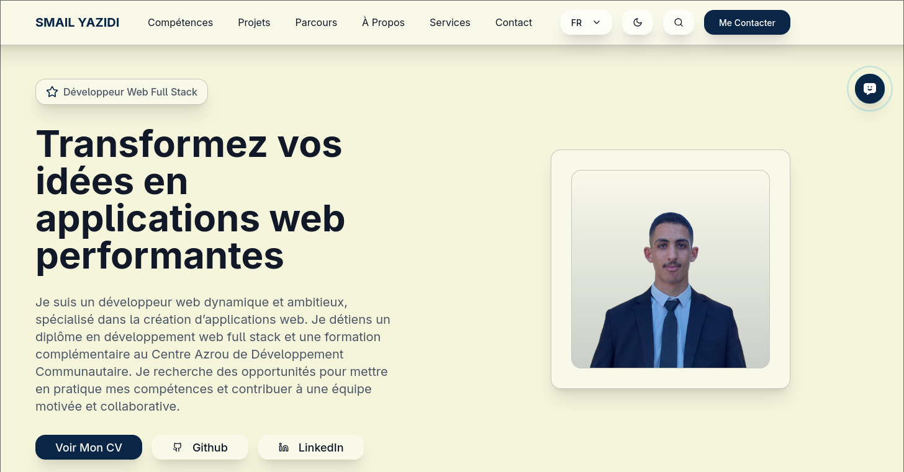
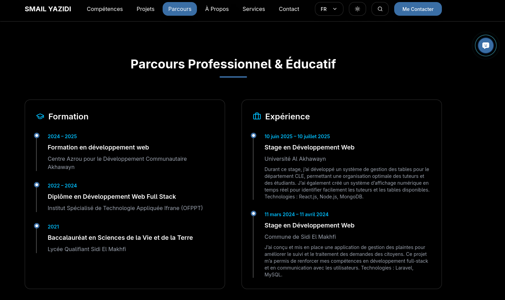
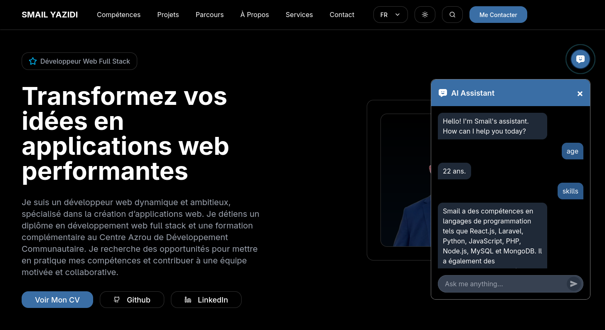
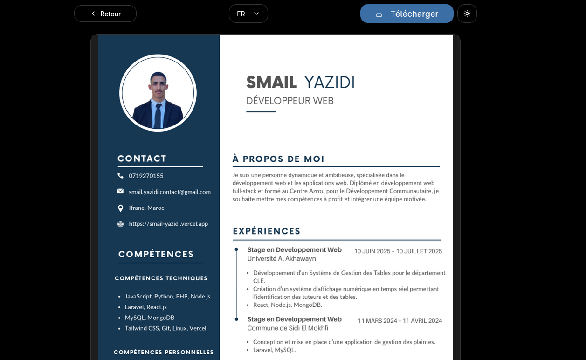
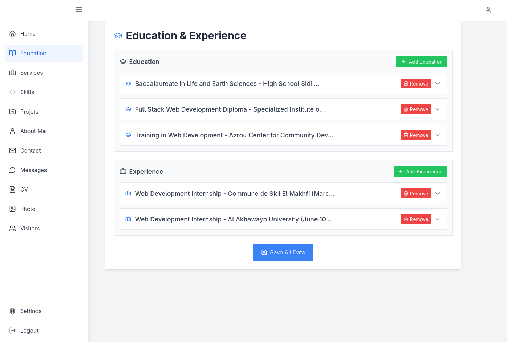

# Personal Portfolio with Admin Dashboard

A modern, full-stack portfolio website with comprehensive admin dashboard, AI assistant integration, and multi-language support. Built with Next.js 14, TypeScript, MongoDB Atlas, and featuring real-time visitor tracking.

## 🌐 Live Demo

Visit the live portfolio: [https://smail-yazidi.vercel.app/](https://smail-yazidi.vercel.app/)


## 📸 Screenshots

### Portfolio Homepage

*Main portfolio interface showcasing the modern glassmorphism design with multi-language support*


*Main portfolio interface showcasing the modern glassmorphism design with multi-language support*


*Main portfolio interface showcasing the modern glassmorphism design with multi-language support*

### AI Assistant Widget

*Interactive AI chat widget providing context-aware assistance about portfolio content*

### CV Viewer Page

*Integrated PDF viewer with download functionality for resume viewing*

### Admin Dashboard

*Comprehensive admin interface for content management and visitor analytics*


## 🚀 Features

### Frontend Portfolio
- **Responsive Design**: Modern glassmorphism UI with dark/light theme toggle
- **Multi-language Support**: English, French, and Arabic with RTL support
- **Interactive Sections**: Hero, About, Skills, Projects, Experience, Services, Contact
- **Real-time Search**: Advanced search functionality across all content
- **CV Viewer**: Integrated PDF viewer with download functionality
- **Visitor Tracking**: Real-time visitor analytics with geolocation
- **Contact Form**: Rate-limited contact form with email validation

### AI Assistant
- **Floating Chat Widget**: Interactive AI assistant for portfolio inquiries
- **Multiple AI Models**: Fallback system using OpenRouter API with free models
- **Context-Aware**: Trained on portfolio data for accurate responses
- **Multi-language**: Responds in visitor's preferred language
- **Rate Limiting**: Token usage tracking and daily limits

### Admin Dashboard
- **Secure Authentication**: NextAuth.js integration
- **Content Management**: Full CRUD operations for all portfolio sections
- **Message Management**: View and manage contact form submissions
- **Visitor Analytics**: Detailed visitor tracking and statistics
- **File Upload**: Image and PDF management with cloud storage
- **Settings Panel**: Site configuration and API key management

## 🛠️ Tech Stack

### Frontend
- **Framework**: Next.js 14 with App Router
- **Language**: TypeScript
- **Styling**: Tailwind CSS with shadcn/ui components
- **Icons**: Lucide React, React Icons
- **State Management**: React Hooks
- **PDF Viewer**: Google Docs embedded viewer
- **Animations**: CSS transitions and transforms

### Backend
- **API**: Next.js API Routes
- **Database**: MongoDB Atlas
- **Authentication**: NextAuth.js
- **File Storage**: Vercel Blob Storage
- **AI Integration**: OpenRouter API
- **Visitor Tracking**: IP geolocation with rate limiting

### External Services
- **AI Models**: Multiple free models via OpenRouter
- **Email**: Contact form with rate limiting
- **Analytics**: Custom visitor tracking system
- **CDN**: Next.js image optimization


## 📊 Database Schema

The MongoDB database contains the following collections:

### Collections Structure

- **users**: Admin authentication
- **hero**: Hero section content
- **about_me**: About section with personal info, languages, interests
- **skills**: Technical skills organized by categories
- **projects**: Portfolio projects with images and descriptions
- **education**: Education and work experience timeline
- **services**: Services offered
- **contact**: Contact information and social links
- **messages**: Contact form submissions
- **settings**: Site configuration
- **visitors**: Visitor analytics and tracking data

### Multi-language Support
Each content field supports three languages:
```json
{
  "title": {
    "en": "English Title",
    "fr": "Titre Français", 
    "ar": "العنوان العربي"
  }
}
```

## 🤖 AI Assistant Features

### Supported Models
The AI assistant uses multiple free models with automatic fallback:
- meta-llama/llama-3.2-3b-instruct:free
- microsoft/phi-3-mini-128k-instruct:free
- huggingfaceh4/zephyr-7b-beta:free
- deepseek/deepseek-r1-0528:free
- openchat/openchat-7b:free

### Rate Limiting
- Daily token limits per model
- Automatic model switching when limits reached
- User-friendly error messages

### Context Training
The AI is trained on your portfolio data and can answer questions about:
- Your skills and experience
- Project details and technologies
- Contact information
- Educational background
- Services offered

## 🔐 Security Features

- **API Key Protection**: All admin endpoints protected with API keys
- **Authentication**: Secure admin authentication with NextAuth.js
- **Rate Limiting**: Contact form and AI assistant rate limiting
- **Input Validation**: Comprehensive input validation and sanitization
- **CORS Protection**: Proper CORS configuration
- **Environment Security**: Sensitive data in environment variables


2. **Deploy to Vercel**
   - Connect your GitHub repository to Vercel
   - Add all environment variables in Vercel dashboard
   - Deploy automatically on push

3. **Configure Custom Domain**
   - Add your custom domain in Vercel settings
   - Update environment variables with production URLs

### Database Setup
- Ensure MongoDB Atlas IP whitelist includes 0.0.0.0/0 for Vercel
- Update connection strings for production

## 🎨 Customization

### Themes
- Modify theme colors in `tailwind.config.ts`
- Update glassmorphism effects in component styles
- Customize dark/light mode transitions

### Languages
- Add new languages in translation objects
- Update RTL support for new languages
- Extend multi-language database schema

### AI Assistant
- Customize system prompts in `/api/ask/route.ts`
- Add new AI models to the fallback array
- Modify token limits and rate limiting

## 📈 Analytics & Monitoring

### Visitor Tracking
- Real-time visitor counting
- Geolocation data collection
- Device and browser information
- Visit timestamp tracking

### Performance Monitoring
- AI model usage tracking
- API response times
- Error logging and handling
- Database query optimization

## 🛡️ Error Handling

- Comprehensive error boundaries
- Graceful API fallbacks
- User-friendly error messages
- Automatic retry mechanisms
- Loading states for all async operations

## 🔄 Updates & Maintenance

### Regular Updates
- Keep dependencies updated
- Monitor AI model availability
- Review visitor analytics
- Backup database regularly

### Content Management
- Use admin dashboard for all content updates
- Preview changes before publishing
- Multi-language content synchronization
- Image optimization and compression

## 📝 License

This project is licensed under the MIT License. See the [LICENSE](LICENSE) file for details.

## 📞 Contact & Collaboration

**Email**: smail.yazidi.contact@gmail.com

### Interested in Similar Projects?
If you're interested in having a similar portfolio or would like to collaborate on web development projects, feel free to reach out. This project demonstrates expertise in:

- Full-stack web development
- Modern React/Next.js applications
- Database architecture and design
- AI integration and API management
- Multi-language application development
- Admin dashboard and content management systems
- Performance optimization and security implementation

## 🤝 Professional Services

This portfolio serves as a demonstration of technical capabilities and is available for:
- **Consultation**: Architecture and technical guidance
- **Development**: Custom portfolio or web application development
- **Code Review**: Technical assessment and optimization recommendations
- **Training**: Modern web development practices and patterns


## 📞 Support

For support, email smail.yazidi.contact@gmail.com or create an issue in the GitHub repository.

## 🙏 Acknowledgments

- [Next.js](https://nextjs.org/) for the amazing framework
- [Tailwind CSS](https://tailwindcss.com/) for utility-first styling
- [shadcn/ui](https://ui.shadcn.com/) for beautiful components
- [MongoDB Atlas](https://www.mongodb.com/atlas) for database hosting
- [OpenRouter](https://openrouter.ai/) for AI model access
- [Vercel](https://vercel.com/) for seamless deployment

---

Made with ❤️ by [Smail Yazidi](https://smail-yazidi.vercel.app/)